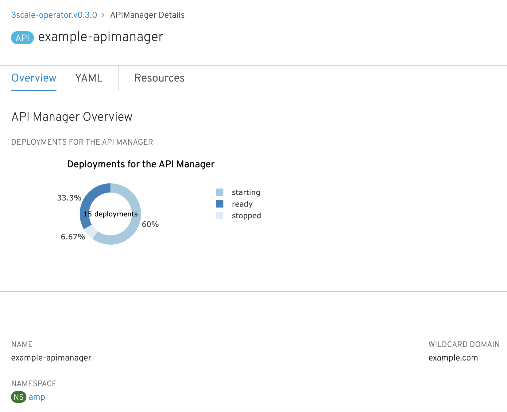

# operator-utils library
[](https://goreportcard.com/report/github.com/RHsyseng/operator-utils)
[](https://travis-ci.org/RHsyseng/operator-utils)


This library layers on top of the Operator SDK, having set of utilities function as a library to easily create Kubernetes operators.

## Features

1. [managing CR and CRD validation](#managing-cr-and-crd-validation)
2. [pods deployment status ](#pods-deployment-status)
3. [resource comparison, adding, updating and deleting](#resource-comparison-adding-updating-and-deleting)
4. [platform detection Kubernetes VS Openshift](#platform-detection-kubernetes-vs-openshift)


## Managing CR and CRD validation

Operator util library use package ``validation`` for validate the CRD  and CR file, these function use as a unit test within operator

**CRD validation Usage**:
```go

schema := getCompleteSchema(t)
 missingEntries := schema.GetMissingEntries(&sampleApp{})
 for _, missing := range missingEntries {
    if strings.HasPrefix(missing.Path, "/status") {
       //Not using subresources, so status is not expected to appear in CRD
    } else {
       assert.Fail(t, "Discrepancy between CRD and Struct", "Missing or incorrect schema validation at %v, expected type %v", missing.Path, missing.Type)
    }
 }


```


**CR validation Usage**:
```go
schema, err := New([]byte(schemaYaml))
 assert.NoError(t, err)

 type myAppSpec struct {
    Number float64 `json:"number,omitempty"`
 }

 type myApp struct {
    Spec myAppSpec `json:"spec,omitempty"`
 }

 cr := myApp{
    Spec: myAppSpec{
       Number: float64(23),
    },
 }
 missingEntries := schema.GetMissingEntries(&cr)
 assert.Len(t, missingEntries, 0, "Expect no missing entries in CRD for this struct: %v", missingEntries)
```
A full example is provided [here](./pkg/validation/schema_sync_test.go)


## Pods deployment status

 showes the status of the deployment on OLM UI in the form of PI chart, as seen in below screenshot



**Usage**:

Below seen line required to add into types.go status structure

```go
PodStatus olm.DeploymentStatus `json:"podStatus"`

```
Add these lines into CSV file inside statusDescriptors section:

```yaml
statusDescriptors:
        - description: The current pods
          displayName: Pods Status
          path: podStatus
          x-descriptors:
            - "urn:alm:descriptor:com.tectonic.ui:podStatuses"
```

For DeploymentConfig deployment status:

```go
var dcs []oappsv1.DeploymentConfig

deploymentStatus := olm.GetDeploymentConfigStatus(dcs)
 if !reflect.DeepEqual(instance.Status.Deployments, deploymentStatus) {
    r.reqLogger.Info("Deployment status will be updated")
    instance.Status.Deployments = deploymentStatus
    err = r.client.Status().Update(context.TODO(), instance)
    if err != nil {
       r.reqLogger.Error(err, "Failed to update deployment status")
       return err
    }
 }

```

For StatefulSet Deployment status:

```go
var status olm.DeploymentStatus
 sfsFound := &appsv1.StatefulSet{}

 err := client.Get(context.TODO(), namespacedName, sfsFound)
 if err == nil {
    status = olm.GetSingleStatefulSetStatus(*sfsFound)
 } else {
    dsFound := &appsv1.DaemonSet{}
    err = client.Get(context.TODO(), namespacedName, dsFound)
    if err == nil {
       status = olm.GetSingleDaemonSetStatus(*dsFound)
    }
 }

```

## Resource comparison (adding, updating and deleting)

Common function for listing, adding, updating, deleting kubernetes objects like seen below:


List of objects that are deployed

```go
reader := read.New(client).WithNamespace(instance.Namespace).WithOwnerObject(instance)
  resourceMap, err := reader.ListAll(
     &corev1.PersistentVolumeClaimList{},
     &corev1.ServiceList{},
     &appsv1.StatefulSetList{},
     &routev1.RouteList{},
  )
```


Compare what's deployed with what should be deployed

```go
requested := compare.NewMapBuilder().Add(requestedResources...).ResourceMap()
comparator := compare.NewMapComparator()
deltas := comparator.Compare(deployed, requested)
```

Adding the objects:

```go

added, err := writer.AddResources(delta.Added)

```

Updating the objects:

```go
updated, err := writer.UpdateResources(deployed[resourceType], delta.Updated)
```

Removing the objects:
```go
removed, err := writer.RemoveResources(delta.Removed)
```


A full usage is provided [here]( https://github.com/kiegroup/kie-cloud-operator/blob/6964179113e4f57d47bead03578ae6ed8e9caa8b/pkg/controller/kieapp/kieapp_controller.go#L136-L163)


## Platform detection Kubernetes VS Openshift

To detect platform whether operator is running on kuberenete or openshift  or what version of openshift is using

```go
  info, err := pv.GetPlatformInfo(c.discoverer, c.config)
```
A full example is provided [here](./internal/platform/platform_versioner_test.go)

## Who is using this Library

This operator util is used by Red Hat Middleware Products Operators some of them list here:  

- [Kie Cloud Operator](https://github.com/kiegroup/kie-cloud-operator)
- [ActiveMQ Artemis Operator](https://github.com/rh-messaging/activemq-artemis-operator)
- [3scale-operator](https://github.com/3scale/3scale-operator)
- [Interconnect-operator](https://github.com/interconnectedcloud/qdr-operator)